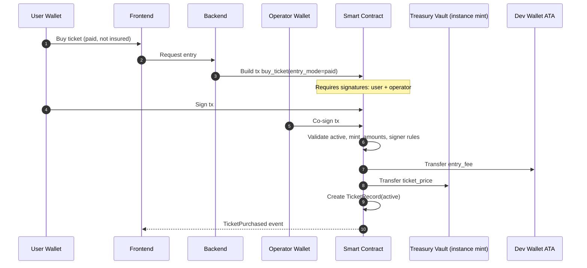
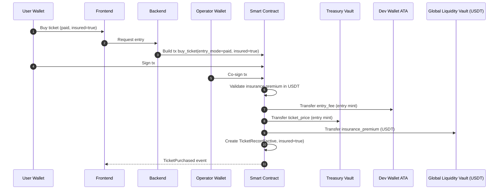
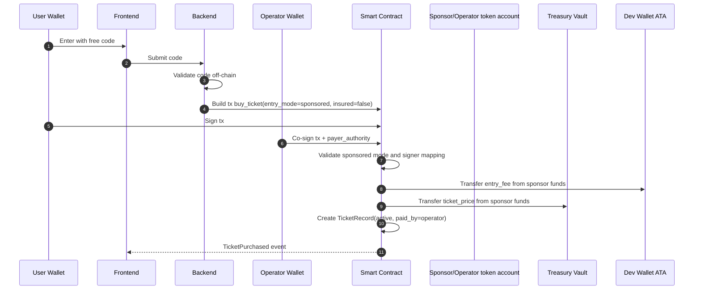
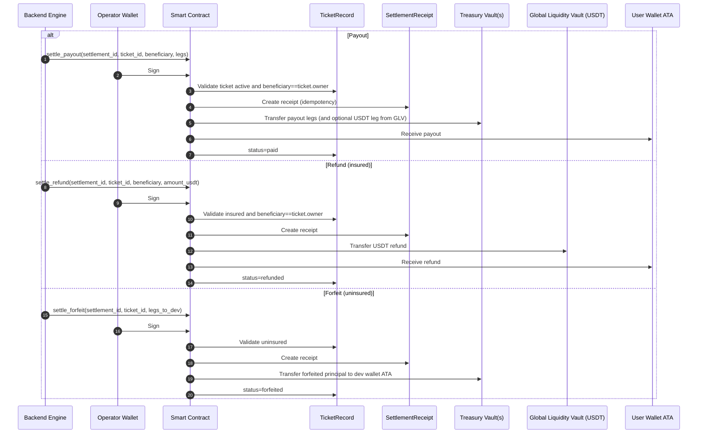
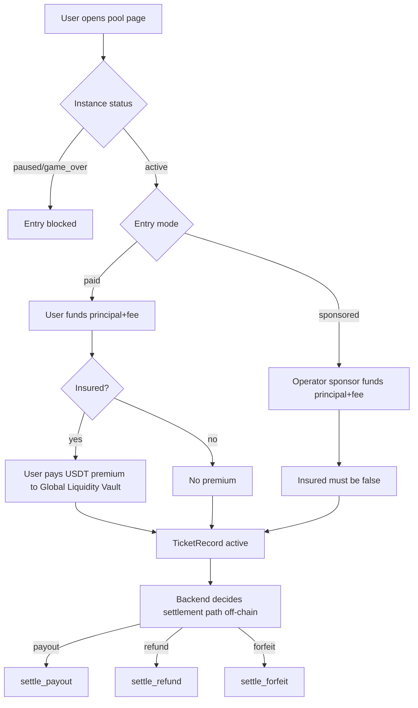

# User Flows Diagrams

## 1) Paid Entry (Not Insured)

```mermaid
sequenceDiagram
    autonumber
    participant U as User Wallet
    participant FE as Frontend
    participant BE as Backend
    participant OP as Operator Wallet
    participant SC as Smart Contract
    participant TV as Treasury Vault (instance mint)
    participant DV as Dev Wallet ATA

    U->>FE: Buy ticket (paid, not insured)
    FE->>BE: Request entry
    BE->>SC: Build tx buy_ticket(entry_mode=paid)
    Note over SC: Requires signatures: user + operator
    U->>SC: Sign tx
    OP->>SC: Co-sign tx
    SC->>SC: Validate active, mint, amounts, signer rules
    SC->>DV: Transfer entry_fee
    SC->>TV: Transfer ticket_price
    SC->>SC: Create TicketRecord(active)
    SC-->>FE: TicketPurchased event
```

## 2) Paid Entry (Insured)

```mermaid
sequenceDiagram
    autonumber
    participant U as User Wallet
    participant FE as Frontend
    participant BE as Backend
    participant OP as Operator Wallet
    participant SC as Smart Contract
    participant TV as Treasury Vault
    participant DV as Dev Wallet ATA
    participant GLV as Global Liquidity Vault (USDT)

    U->>FE: Buy ticket (paid, insured=true)
    FE->>BE: Request entry
    BE->>SC: Build tx buy_ticket(entry_mode=paid, insured=true)
    U->>SC: Sign tx
    OP->>SC: Co-sign tx
    SC->>SC: Validate insurance premium in USDT
    SC->>DV: Transfer entry_fee (entry mint)
    SC->>TV: Transfer ticket_price (entry mint)
    SC->>GLV: Transfer insurance_premium (USDT)
    SC->>SC: Create TicketRecord(active, insured=true)
    SC-->>FE: TicketPurchased event
```

## 3) Sponsored Entry (Free Code)

```mermaid
sequenceDiagram
    autonumber
    participant U as User Wallet
    participant FE as Frontend
    participant BE as Backend
    participant OP as Operator Wallet
    participant SC as Smart Contract
    participant SP as Sponsor/Operator token account
    participant TV as Treasury Vault
    participant DV as Dev Wallet ATA

    U->>FE: Enter with free code
    FE->>BE: Submit code
    BE->>BE: Validate code off-chain
    BE->>SC: Build tx buy_ticket(entry_mode=sponsored, insured=false)
    U->>SC: Sign tx
    OP->>SC: Co-sign tx + payer_authority
    SC->>SC: Validate sponsored mode and signer mapping
    SC->>DV: Transfer entry_fee from sponsor funds
    SC->>TV: Transfer ticket_price from sponsor funds
    SC->>SC: Create TicketRecord(active, paid_by=operator)
    SC-->>FE: TicketPurchased event
```

## 4) Settlement Paths

```mermaid
sequenceDiagram
    autonumber
    participant BE as Backend Engine
    participant OP as Operator Wallet
    participant SC as Smart Contract
    participant TR as TicketRecord
    participant SR as SettlementReceipt
    participant TV as Treasury Vault(s)
    participant GLV as Global Liquidity Vault (USDT)
    participant U as User Wallet ATA

    alt Payout
        BE->>SC: settle_payout(settlement_id, ticket_id, beneficiary, legs)
        OP->>SC: Sign
        SC->>TR: Validate ticket active and beneficiary==ticket.owner
        SC->>SR: Create receipt (idempotency)
        SC->>TV: Transfer payout legs (and optional USDT leg from GLV)
        SC->>U: Receive payout
        SC->>TR: status=paid
    else Refund (insured)
        BE->>SC: settle_refund(settlement_id, ticket_id, beneficiary, amount_usdt)
        OP->>SC: Sign
        SC->>TR: Validate insured and beneficiary==ticket.owner
        SC->>SR: Create receipt
        SC->>GLV: Transfer USDT refund
        SC->>U: Receive refund
        SC->>TR: status=refunded
    else Forfeit (uninsured)
        BE->>SC: settle_forfeit(settlement_id, ticket_id, legs_to_dev)
        OP->>SC: Sign
        SC->>TR: Validate uninsured
        SC->>SR: Create receipt
        SC->>TV: Transfer forfeited principal to dev wallet ATA
        SC->>TR: status=forfeited
    end
```

## 5) High-Level User Flow

```mermaid
flowchart TD
    A[User opens pool page] --> B{Instance status}
    B -->|paused/game_over| X[Entry blocked]
    B -->|active| C{Entry mode}
    C -->|paid| D[User funds principal+fee]
    C -->|sponsored| E[Operator sponsor funds principal+fee]
    D --> F{Insured?}
    F -->|yes| G[User pays USDT premium to Global Liquidity Vault]
    F -->|no| H[No premium]
    E --> I[Insured must be false]
    G --> J[TicketRecord active]
    H --> J
    I --> J
    J --> K[Backend decides settlement path off-chain]
    K -->|payout| L[settle_payout]
    K -->|refund| M[settle_refund]
    K -->|forfeit| N[settle_forfeit]
```
