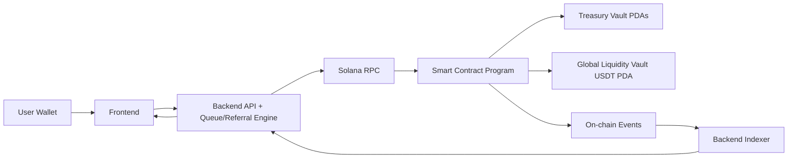

# 01 - System Boundary

## Objective

Define explicit ownership boundaries between Backend, Blockchain (Smart Contract), and Frontend.

## Ownership Matrix

| Capability | Backend | Blockchain (SC) | Frontend |
|---|---|---|---|
| Queue ordering and head/tail progression | Owner | None | Display only |
| Referral validation and counters | Owner | None | UX input + status display |
| Timer scanning / expiry detection | Owner | None | Display only |
| Instance deployment/config persistence | Trigger/admin workflow | Owner | Admin UI trigger |
| User deposits and fund split execution | Build co-signed tx intent | Owner | Wallet signing + submit |
| Payout/refund/forfeit eligibility decision | Owner | None | Display only |
| Payout/refund/forfeit token transfer execution | Trigger settlement | Owner | History/status view |
| Replay protection | Optional app-level dedupe | Owner (authoritative) | None |
| Analytics and dashboards | Owner (indexer/API) | Event source | Owner (UI) |

## RACI (Key Actions)

| Action | Responsible | Accountable | Consulted | Informed |
|---|---|---|---|---|
| Deploy instance | Backend Ops | Admin Owner | SC Team | FE Team |
| Freeze/unfreeze | Admin Owner | Admin Owner | SC Team | BE/FE |
| Buy ticket | User + FE + BE | Product Ops | SC Team | Analytics |
| Settle payout/refund | Backend Operator | Product Ops | SC Team | FE/User |
| Top up insurance | Master Wallet Ops | Product Ops | SC Team | FE |
| Set game over + batch settle | Backend Operator | Product Ops | SC Team | FE/User |

## Out of Scope for Smart Contract

- Queue ordering algorithms.
- Referral code generation, referral count tracking, spillover logic.
- Keeper scheduling and periodic scans.
- UI rendering and API aggregation.

## In Scope for Smart Contract

- PDA vault custody and token movements.
- Factory + per-instance configuration state.
- Global role-based access control (`dev`, `master`, `operator`).
- Mandatory backend co-signer validation for ticket entry authorization.
- Settlement idempotency via receipt accounts.
- Event emission and verifiable audit trail.

## Data/Control Flow

## Operational Principle

Backend is the source of truth for game progression decisions. Smart contract is the source of truth for money movement correctness and final settlement integrity.

## Entry Authorization Model

1. Entry is always `operator co-sign required`.
2. Transaction must include both signers: `user` and global `operator_wallet`.
3. Contract verifies `operator_wallet` signer equals `factory_state.operator_wallet`.
4. Direct user scripts without operator co-sign must fail.
5. Entry mode policy:
   - `paid` entry is user-funded.
   - `sponsored` entry is operator-funded and used for promo/free-code onboarding.
